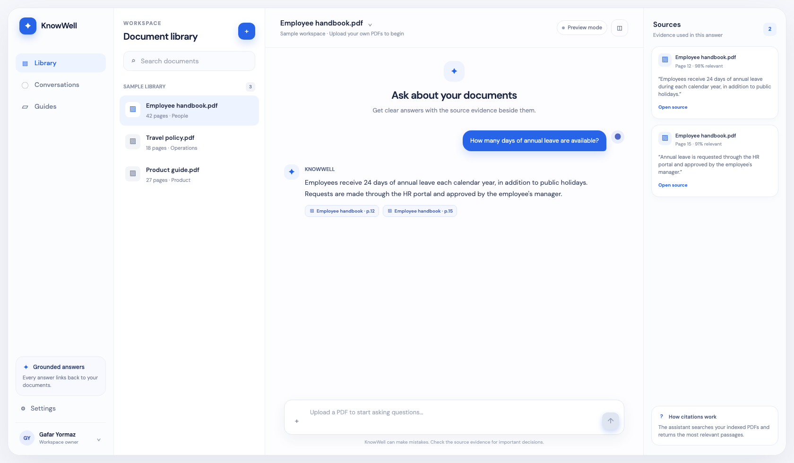

# Production RAG Knowledge Assistant

A full-stack Retrieval-Augmented Generation (RAG) application for asking grounded questions over uploaded PDF documents. It is designed as a portfolio-ready baseline: the API validates uploads, stores files safely, detects duplicates, returns source citations, and persists document metadata.



## What it does

1. Upload a text-based PDF.
2. Extract its text page by page and split it into overlapping chunks.
3. Create OpenAI embeddings and save the chunks in ChromaDB.
4. Retrieve the most relevant chunks for a question.
5. Generate an answer that is restricted to that retrieved evidence.
6. Return the answer together with the filename, page number, excerpt, and relevance of each source.

Scanned PDFs are intentionally rejected because they require an OCR stage first.

## Stack

- Backend: FastAPI, OpenAI, ChromaDB, SQLite, pypdf
- Frontend: React, TypeScript, Vite, Tailwind CSS
- Runtime: Docker / Docker Compose supported

## Reliability features

- PDF extension and file-signature validation
- Configurable 10 MB upload limit
- UUID-based storage names instead of user-supplied filesystem paths
- SHA-256 duplicate detection backed by a SQLite unique constraint
- Cleanup if ingestion fails midway
- Dedicated health endpoint
- Grounded-answer instruction and source citations
- API error responses for invalid, duplicate, oversized, or premature requests
- Small automated test suite for health and upload validation

## Quick start

### 1. Configure environment variables

```bash
cp .env.example .env
```

Set `OPENAI_API_KEY` in `.env`. The API reads `OPENAI_MODEL`, `EMBEDDING_MODEL`, `MAX_UPLOAD_SIZE_MB`, and `FRONTEND_ORIGINS` from the same file.

### 2. Run the backend

```bash
python -m venv .venv
source .venv/bin/activate
pip install -r requirements.txt
uvicorn main:app --reload
```

The API is available at `http://127.0.0.1:8000` and health is available at `GET /health`.

### 3. Run the frontend

In a second terminal:

```bash
npm install
npm run dev
```

Set `VITE_API_URL=http://127.0.0.1:8000` in `.env` before starting Vite.

### Docker

For the API only:

```bash
docker compose up --build
```

The named Docker volume retains the SQLite metadata, uploaded PDFs, and Chroma data between container restarts.

## API

### `POST /upload`

Send `multipart/form-data` with a `file` field.

```json
{
  "document_id": "b8d7...",
  "filename": "handbook.pdf",
  "message": "Document uploaded and indexed successfully."
}
```

### `GET /documents`

Returns persisted document metadata so the frontend can restore its document list after a refresh.

### `POST /chat`

```json
{ "question": "What is the refund policy?" }
```

```json
{
  "answer": "...",
  "confidence": 0.86,
  "sources": [
    {
      "filename": "handbook.pdf",
      "page_number": 4,
      "excerpt": "..."
    }
  ]
}
```

## Tests

```bash
pytest
npm run lint
npm run build
```

## Architecture

```text
PDF → validate → safe local storage → text/page extraction → chunking
    → OpenAI embeddings → ChromaDB

Question → query embedding → Chroma similarity search → evidence-only LLM answer
         → answer + source citations
```

## Project structure

```text
main.py                   FastAPI application and CORS/lifespan setup
config.py                 Environment-backed application settings
routers/                  Upload, document list, chat, health endpoints
services/                 Validation, extraction, embeddings, answer generation, SQLite metadata
vector_store/             ChromaDB persistence and retrieval
src/                      React interface
tests/                    Focused backend checks
```

## Next production steps

This project is intentionally a single-user local portfolio application. A production multi-user version should add authentication, object storage, background jobs, per-user document isolation, rate limiting, observability, and RAG evaluation datasets.

## License

MIT License © Gafar Yormaz
